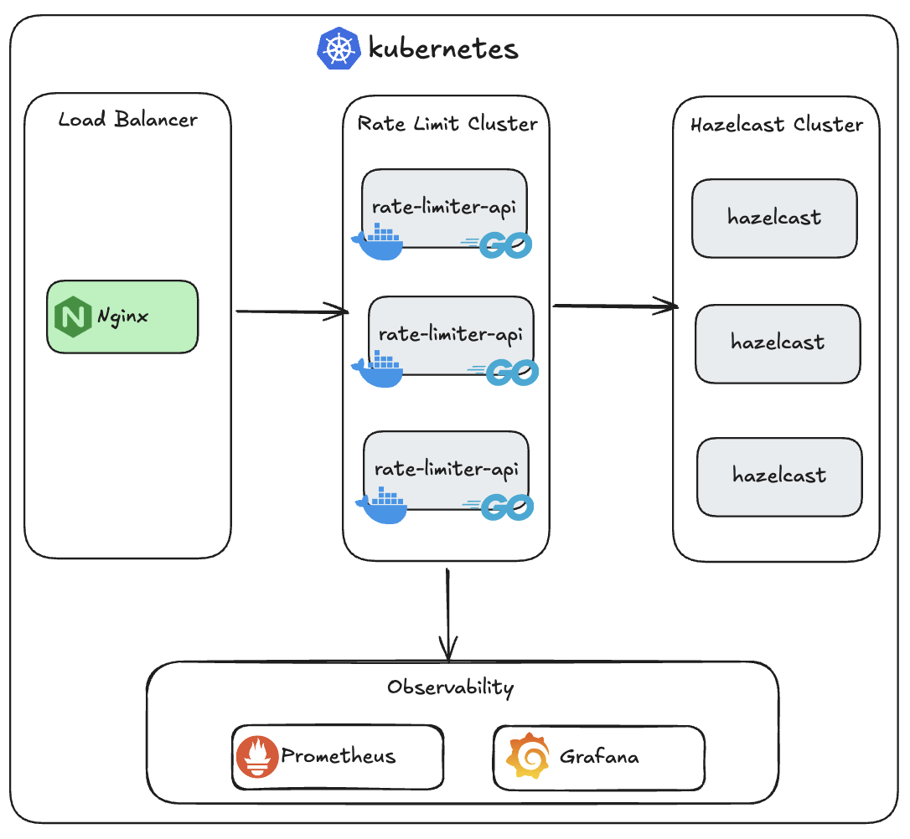

# Distributed Lock and Rate Limiting API

Projeto desenvolvido em Golang que implementa controle de concorrência com distributed lock e rate limiting por cliente, utilizando o Hazelcast para gerenciamento de estado compartilhado e o Nginx como balanceador de carga.

O algoritmo de rate limiting adotado é o Fixed Window Time, no qual cada cliente possui um número limitado de requisições permitido dentro de um intervalo de tempo definido. Ao término desse período, a cota de requisições é automaticamente renovada, garantindo simplicidade no controle de acesso e previsibilidade no consumo.

## Arquitetura

- **Load Balancer (Nginx)** → roteia tráfego.
- **Rate Limit Cluster (APIs em Go)** → múltiplas réplicas para resiliência e escalabilidade.
- **Hazelcast Cluster** → armazenamento em memória + locks distribuídos.
- **Observabilidade** → Prometheus (métricas) + Grafana (dashboards).



---

## Resiliência: múltiplas instâncias

### API
- Evita downtime em falhas (alta disponibilidade).
- Permite **escalabilidade horizontal**.
- Suporta **rolling updates** sem indisponibilidade.
- Stateless (estado no Hazelcast).

### Hazelcast
- **Replicação de dados**: evita perda em falhas.
- **Quorum**: garante consistência do cluster.
- **Distribuição de carga**: baixa latência em alto volume.
- **Locks distribuídos**: controle de race condition.

👉 Produção: **mínimo 3 nós Hazelcast** + **2–3 réplicas da API**.

---

## Uso do Hazelcast

1. **Armazenamento em memória** → estado do cliente (contador, janela, bucket).
2. **Distributed Lock** → garante exclusão mútua por cliente.
3. **Chave única por cliente** → mesma key para lock e dados → evita race condition.

---

## Endpoints

#### Validate rate limit middleware


```bash
curl -X GET http://localhost:9999/example \
  -H "X-Api-Id: <client-id>"
```

#### Response
```json
{
   "message": "Hello World"
}
```

#### Create Client
```bash
curl -X POST http://localhost:9999/bucket \
  -H "Content-Type: application/json" \
  -d '{"name":"client123"}'
```

#### Response 
```json
{
  "name": "client123",
  "id": "efc8cd40-2574-489f-8be8-79802b5a623a"
}
```

### Execução local (Docker Compose)
```bash
git clone https://github.com/leocrispindev/distributed-rate-limit.git
cd distributed-rate-limit
docker-compose up -d
```

### Test
É possível testar a aplicação utilizando o K6:
```bash
k6 run test-rate-limit.js
```